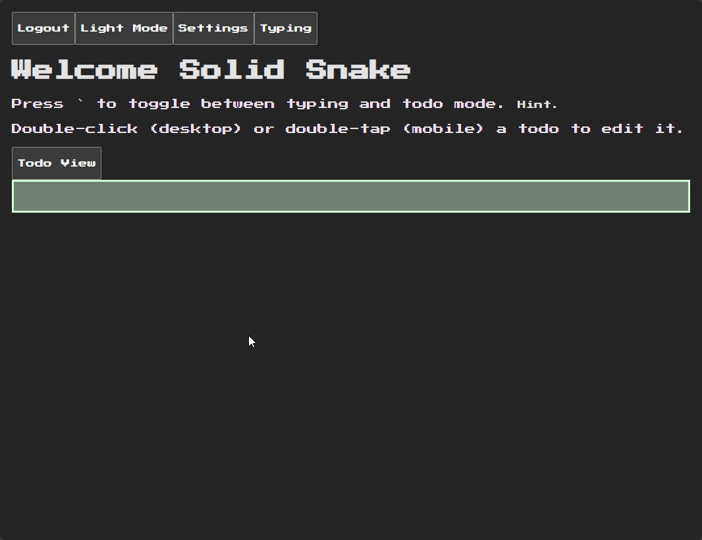

# 🕹️ Retro Todo App

**Retro Todo App** is a nostalgic way to get things done — a full stack to-do application inspired by the Casio digital diaries of the '80s and '90s.

Built with **React**, **Node.js**, **Express**, and **Appwrite**.

🚀 <a href="https://rtodo-temp23-beta.onrender.com" target="_blank"><strong>Live Demo →</strong></a>



## 🌟 Features

- ✍️ Create, edit, delete, and complete todos (CRUD)
- 🧑‍💻 Customizable user nickname
- ⌨️ Keyboard shortcuts for efficient workflow
- 🗃️ Split view for active and completed todos
- 🔐 Email & password authentication

## 🚀 Installation

1. **Create an Appwrite project** with collections for users and todos.  
   - Follow the data model in the backend controllers to set up collection attributes correctly.

2. **Create a `.env` file** and add your Appwrite environment variables (e.g., `VITE_APPWRITE_PROJECT_ID`, `VITE_APPWRITE_ENDPOINT`, etc.).

3. Install and build:

   ```bash
   npm install
   npm run build
   npm run start

4. Visit `http://localhost:5000/login`

## ⌨️ Keybindings
- <kbd>`</kbd> (backtick): Toggle between typing mode and todo list
- <kbd>Enter</kbd>: Submit or update a todo while in typing mode

## ⚙️ Back Dependencies
- cors — ^2.8.5
- dotenv — ^16.5.0
- express — ^5.1.0
- node-appwrite — ^17.0.0
- nodemon — ^3.1.10

## 🎨 Front Dependencies
- appwrite — ^18.1.1
- react — ^19.1.0
- react-dom — ^19.1.0
- react-router-dom — ^7.6.2
- zustand — ^5.0.5

## 🍔 Tech Stack
- Frontend: React + Vite
- Backend: Node.js + Express
- Database & Auth: Appwrite

## 🛠️ Planned Improvements
- Responsive layout for mobile screens
- Magic email link login
- Forgot password recovery
- Option to delete user account